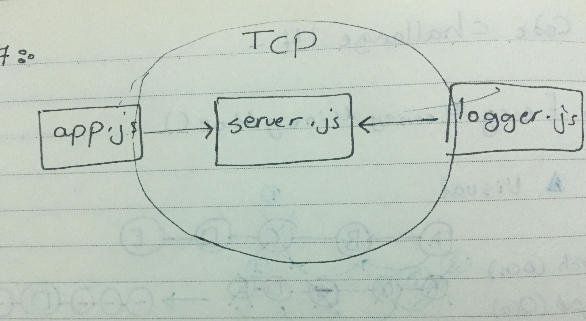

# lab-17

## Author: As-har Oran
## Links and Resources
* (pull request ) : [https://github.com/asharoran-401-advanced-javascript/lab-17/pull/1]
* ( action) : [https://github.com/asharoran-401-advanced-javascript/lab-17/actions]

## Setup
create 3 four folder (server , event , logger, app)
- npm init -y
- npm install , npm i uuid
## .env requirements
- PORT - 3001

## How to initialize/run your server app (where applicable)
- Start App: npm start

## Tests
Unit Tests: npm test , npm run test
Eslint: npm run lint

## UML 
* (white Board) : 